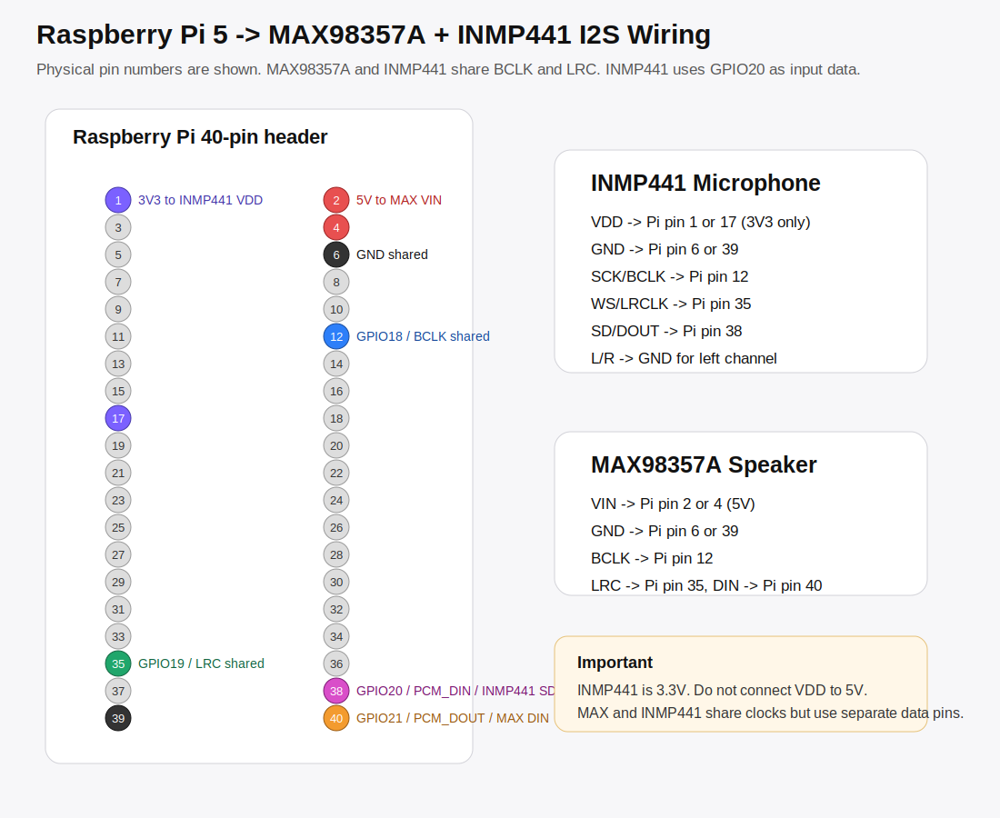

# INMP441 I2S Mikrofon

INMP441, Raspberry Pi'ye I2S uzerinden dijital mikrofon girisi ekler. MAX98357A ile birlikte kullanilabilir, fakat ikisi ayni I2S bus'i paylastigi icin yazilim tarafi USB mikrofon kadar basit degildir.

Onerilen hedef mimari:

```text
INMP441 I2S   -> mikrofon girisi
MAX98357A I2S -> hoparlor cikisi
```

## Baglanti



INMP441:

| INMP441 | Raspberry Pi physical pin | GPIO / islev |
| --- | ---: | --- |
| `VDD` | `1` veya `17` | `3V3` |
| `GND` | `6` veya `39` | `GND` |
| `SCK` / `BCLK` | `12` | `GPIO18 / PCM_CLK` |
| `WS` / `LRCLK` | `35` | `GPIO19 / PCM_FS` |
| `SD` / `DOUT` | `38` | `GPIO20 / PCM_DIN` |
| `L/R` | `GND` | left channel |

MAX98357A ayni clock hatlarini paylasir:

| MAX98357A | Raspberry Pi physical pin | GPIO / islev |
| --- | ---: | --- |
| `VIN` | `2` veya `4` | `5V` |
| `GND` | `6` veya `39` | `GND` |
| `BCLK` | `12` | `GPIO18 / PCM_CLK` |
| `LRC` | `35` | `GPIO19 / PCM_FS` |
| `DIN` | `40` | `GPIO21 / PCM_DOUT` |

Not: INMP441 kesinlikle `3.3V` ile beslenmeli. `5V` baglama.

## Yazilim Durumu

Raspberry Pi overlay sistemi `dtoverlay` ile donanim tanitir. Resmi overlay sistemi tek tek kartlari tanitabilir, fakat MAX98357A ve INMP441 ayni I2S bus'i paylastiginda iki ayri overlay her zaman birlikte calismaz. Raspberry Pi forumlarinda da ayni kombinasyonda yalniz son overlay'in calismasi sorunu rapor edilmis.

Bu nedenle iki yol var:

1. Deneysel hizli test: `googlevoicehat-soundcard` overlay'ini dene.
2. Kalici cozum: MAX98357A + INMP441 icin tek bir custom device-tree overlay yaz.

Ilk once deneysel yolu deneyecegiz.

## Deneysel Kurulum

```bash
cd ~/pi_tablet_telefon
git pull origin main
bash device/scripts/setup-inmp441-googlevoicehat-experimental.sh
sudo reboot
```

Reboot sonrasi:

```bash
cd ~/pi_tablet_telefon
bash device/scripts/check-inmp441.sh
```

Beklenen:

- `arecord -l` icinde bir capture device gorunmeli.
- `aplay -l` icinde playback device gorunmeli.

Kayit testi:

```bash
arecord -D plughw:CARD,0 -f S32_LE -r 48000 -c 1 -d 5 ~/inmp441-test.wav
aplay ~/inmp441-test.wav
```

`CARD` yerine `arecord -l` ciktisindaki kart numarasini yaz.

## Geri Alma

Deneysel overlay speaker cikisini bozarsa:

```bash
sudo cp /boot/firmware/config.txt.inmp441-backup /boot/firmware/config.txt
sudo reboot
```

Sonra MAX98357A tekrar kontrol edilir:

```bash
aplay -l
speaker-test -D plughw:2,0 -t sine -f 440 -l 1
```

## Kaynaklar

- https://www.raspberrypi.com/documentation/computers/config_txt.html
- https://raw.githubusercontent.com/raspberrypi/firmware/master/boot/overlays/README
- https://forums.raspberrypi.com/viewtopic.php?t=389717
- https://forums.raspberrypi.com/viewtopic.php?t=397063
